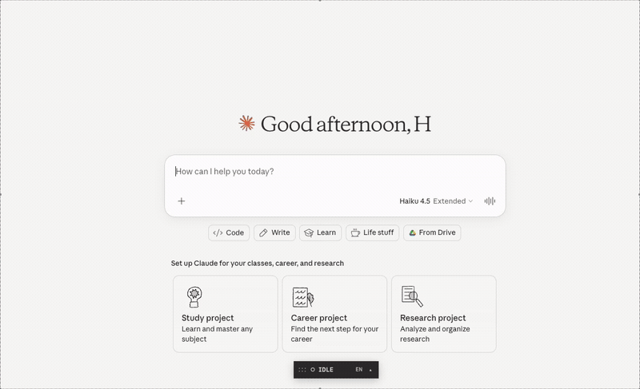

# VoiceType

**Local, hotkey-driven voice-to-text that types wherever you click.** No cloud API. No subscription. Just press a hotkey, speak, and your words appear in any text field — browsers, terminals, coding tools, anything.

<p align="center">
  
</p>

## Why VoiceType?

Most voice-to-text tools give you a text box. VoiceType gives you a **hotkey** — press it anywhere, in any app, and your speech gets transcribed and injected right where your cursor is. It works in places that don't even have microphone support, like terminals and coding tools.

Everything runs locally on your machine using [faster-whisper](https://github.com/SYSTRAN/faster-whisper). Your audio never leaves your computer.

## Quick Start (macOS)

```bash
git clone https://github.com/Honeybee1023/VoiceType.git
cd voicetype
chmod +x setup.sh && ./setup.sh
source .venv/bin/activate
python3 voicetype_agent.py
```

Default hotkey: **Ctrl+Shift+R** — press once to start recording, press again to stop and inject text.

> **First run notes:** If `PyAudio` build fails, run `brew install portaudio ffmpeg` first, then re-run `./setup.sh`. macOS will also prompt you to grant Microphone, Accessibility, and Automation permissions to your terminal — accept all three.

## Quick Start (Windows)

```bash
git clone https://github.com/honeybee1023/voicetype.git
cd voicetype
python -m venv .venv
.\.venv\Scripts\activate
python -m pip install -r requirements.txt
python voicetype_agent.py
```

Default hotkey: **Alt+Shift+R**

## Features

- **Global hotkey workflow** — press once to record, press again to transcribe and inject. Works system-wide.
- **Focus-aware text injection** — uses macOS Accessibility APIs and Windows Win32 APIs to inject text directly into the focused element, with clipboard and keyboard fallbacks.
- **Fully local transcription** — powered by faster-whisper (Whisper). No internet connection required after setup.
- **Always-on status indicator** — a draggable pill shows recording state (idle/recording/working). Stays on top across all spaces.
- **Long recording support** — record for minutes or hours. Useful for transcribing meetings, lectures, or conversations.
- **Multi-language** — English, Chinese Simplified, and Chinese Traditional. Switch via the indicator menu.

## How It Works

1. Press the hotkey → VoiceType captures your currently focused UI element and starts recording.
2. Press the hotkey again → recording stops.
3. Audio is transcribed locally with Whisper.
4. Transcript is injected into the stored focused element.
5. If native injection fails, it falls back to clipboard paste or keyboard typing.

## Configuration

```bash
python3 voicetype_agent.py \
  --hotkey "<ctrl>+<shift>+r" \
  --model "base.en" \
  --language "en" \
  --max-record-seconds 0   # 0 = unlimited recording
```

## Platform Support

| | macOS | Windows |
|---|---|---|
| Hotkey | ✅ | ✅ |
| Recording + Transcription | ✅ | ✅ |
| Native text injection (Accessibility API) | ✅ | ✅ (Win32 SendInput) |
| Clipboard fallback | ✅ | ✅ |
| Status indicator | ✅ (native Cocoa pill) | ✅ (Tkinter) |
| Language switching | ✅ | ✅ |

## Requirements

- macOS or Windows
- Python 3.10+
- Microphone access

### macOS Permissions (First Run)

1. **System Settings → Privacy & Security → Microphone**: allow your terminal.
2. **System Settings → Privacy & Security → Accessibility**: allow your terminal.
3. **System Settings → Privacy & Security → Automation**: allow terminal → System Events.

## Chinese Mode

Chinese modes use the multilingual Whisper `medium` model. The first time you switch to Chinese, the model downloads automatically (~1.5 GB). English mode stays on the faster English-only model.

To pre-download:

```bash
source .venv/bin/activate
python3 -c "from faster_whisper import WhisperModel; WhisperModel('medium', device='auto', compute_type='default')"
```

## Architecture

VoiceType is intentionally built around a single entrypoint script (`voicetype_agent.py`) with a small platform adapter layer in `vt_platform/` to keep things understandable, debuggable, and easy to run.

- `pynput` — global hotkey listener, mouse click tracking, keyboard/mouse fallback injection
- `PyAudio` — real-time microphone PCM capture
- `faster-whisper` — local Whisper transcription with selectable model size/device/compute
- `pyobjc` (macOS) — Accessibility APIs for focus-aware text injection
- `ctypes`/Win32 (Windows) — SendInput for direct text injection

## License

MIT
